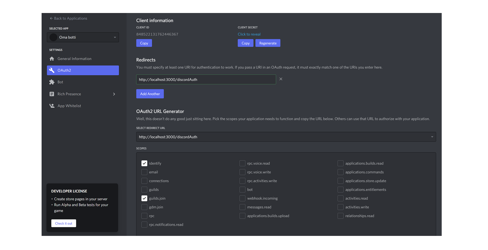

# Setup for the backend

## OAuth2 guide

[Discord.js Guide - Basic Web Server](https://discordjs.guide/oauth2/#setting-up-a-basic-web-server)

Go to the [developers application page](https://discord.com/developers/applications) and follow these instructions.

Select your application and go to "OAuth2" tab.

### Client secret

Copy client secret from developer portal OAtuth section and set to .env `CLIENT_SECRET`.

### Scopes

Select correct redirect url from drop down menu. From the scopes select **indentify** and **guild.join**.

### Redirects

Set redirect to **<backend_server_url>/discordAuth** to `DISCORD_REDIRECT_URL`, e.g. if you are using local server use **http://localhost:3000/discordAuth**

### Backend server url

From Discord add your default discord server invite to .env `DISCORD_SERVER_INVITE`. This can be found from the _#guide_ channel.

Add your backend server url to `BACKEND_SERVER_URL`, e.g. if you are using local server use **http://localhost**.

Add your local port to `PORT`, e.g. 3000.

### Session secret

Give `SESSION_SECRET` any value you want to use.

