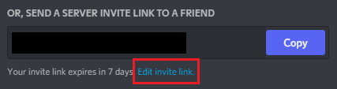

# Create your server

## New server

Before you can create a Discord server, you need to create yourself Discord account. You can do this on [Discord Website](https://discord.com/). If you already have the the account, just login.

Click the "+" button on the left-hand column.


A new window opens. Choose the option "Create My Own". Next you can choose the profile of your server "For a club or community" or "For me and my friends". Finally give your server a name.

## Server settings

In the bottom left, next to your user icon, you can find a cogwheel with the label `User Settings`. From there select `Advanced`. Switch on the Developer Mode.


Next, obtain the server ID for your server. Right click on top of your server icon (on left hand column.)  From there choose copy ID.

```
Add this ID to `.env` file : GUILD_ID=your-discord-server-id.
```

Finally, obtain the invite link for your server. Right click on top of your server icon and choose `Invite People`. A new window opens. At the bottom, click `Edit invite link`



From the dropdown list for `Expire after`, choose `Never`. Press `Generate a new link`.

```
Add this ID to `.env` file : DISCORD_SERVER_INVITE=your-discord-server-invite.
```