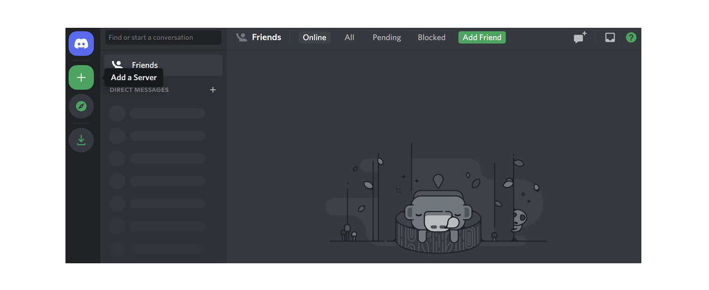
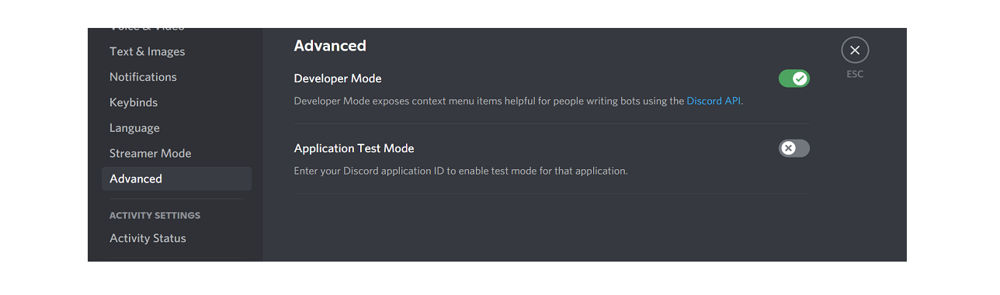

# Create your server

## New server

Before you can create a Discord server, you need to creat yourself Discord account. You can do this on [Discord Website](https://discord.com/). If you already have the the account, just login.

Click the "+" button on the left hand column.



New window open. Choose the option "Create My Own". Next you can choose the profile of your server "For a club or community" or "For me and my friends". Finally give your server a name.

## Server settings

From the bottom left, next to your user icon you can find `User Settings`. From there select `Advanced`. Switch on the Developer Mode.



Finally obtain the server ID from your server. Right click on top of your server icon (on left hand column.)  From there choose copy ID.

```
Add this ID to `.env` file : GUILD_ID=your-discord-server-id.
```
