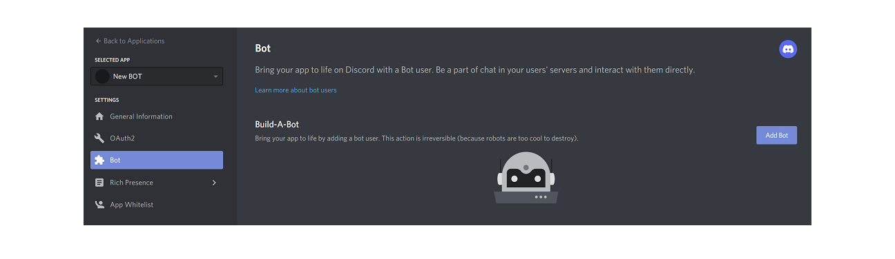
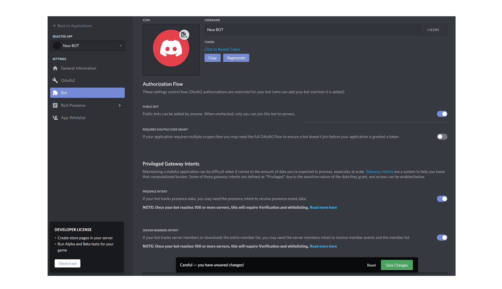
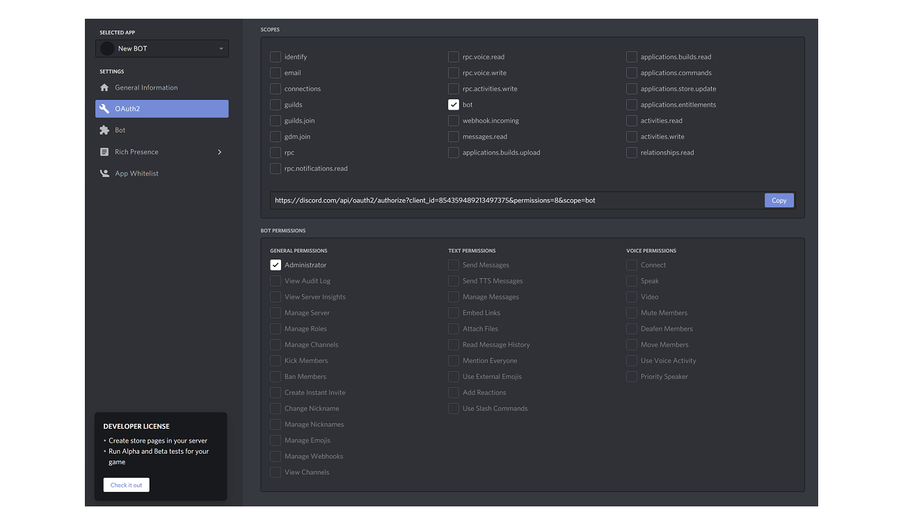

# Instructions for the Bot

## Create your bot

Before you can create a Discord bot, you need to creat yourself Discord account and server. If you don´t have it yet, see instructions over [here](./discordserver.md). If you already have the the account and server, login to your account.

Next go to the [developers application page](https://discord.com/developers/applications) and follow these instructions.

On the main view click "New Application button"


Next give your Bot a name and click the "Create" button.

Go to the "Bot" tab and click "Add Bot" button on the right. Confirm the pop-up window by clicking "Yes, do it!"



Your Bot has been created.

Under Privileged Gateway Intents put `PRESENCE INTENT` and `SERVER MEMBERS INTENT` on and save your changes.



Get your Bot token by clicking the "Copy" button. 


```
Add this token to `.env` file : BOT_TOKEN=your-own-token.
```

## Connect your bot to your Discord server

To connect your Bot to your Discord server, you need to create an invite URL. Go to "OAuth2" tab. 



Under the `SCOPES` select the **bot** and under the `BOT PERMISSIONS` select the **Administrator**. Next copy the link and paste it to your browser. Choose the server you want to invite your Bot to.
