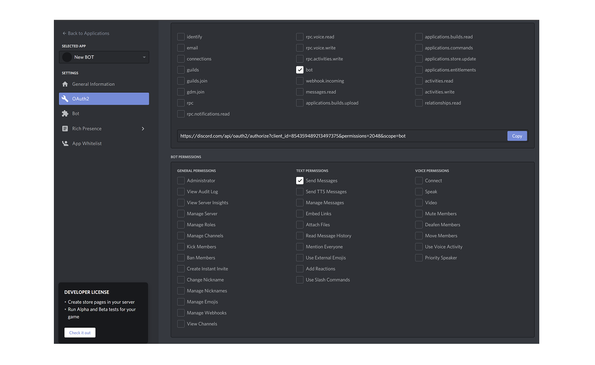
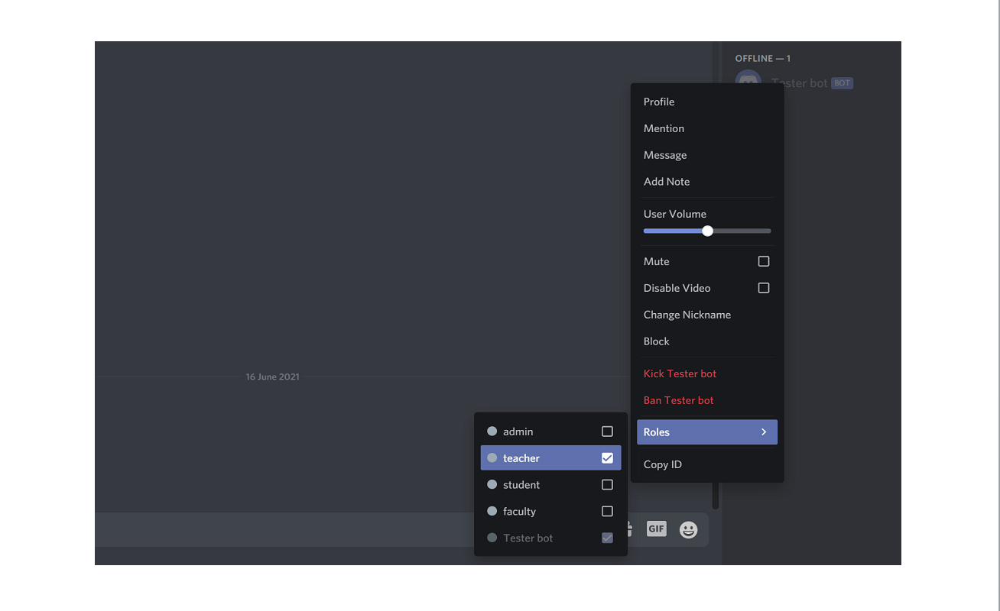

# Instructions for the testing Bot

You will need to create another Bot that sends the test commands.

Go to the [developers application page](https://discord.com/developers/applications) and follow these instructions.

On the main view click "New Application button"


Next give your test Bot a name and click the "Create" button.

Go to the "Bot" tab and click "Add Bot" button on the right. Confirm the pop-up window by clicking "Yes, do it!"


Your test Bot has been created.

Get your Bot token by clicking the "Copy" button. 


```
Add this token to `.env` file : CORDE_BOT_TOKEN=token-of-your-testing-bot-you-just-created
```

## Connect your bot to your Discord server

Next connect your test Bot to your Discord server, with an invite URL. Go to "OAuth2" tab.



Under the `SCOPES` select the **bot** and under the `BOT PERMISSIONS` select the **Send Messages**. Next copy the link and paste it to your browser. Choose the server you want to invite your test Bot to.

Next go to your server.  Right click on top of your test Bot icon (on right hand column.) Choose **Roles** and select **teacher** role.



Before we can do testing, we need to set rest `.env` settings.

```
Add the main Bot token to: BOT_TEST_ID=id-of-your-bot-being-tested
```

On your server, on left hand column there is `BOT CHANNELS` and under that `commands`. Right click on top of that and choose **Copy ID**. 

```
Add this ID to: CHANNEL_ID=channel-for-the-tests
```
