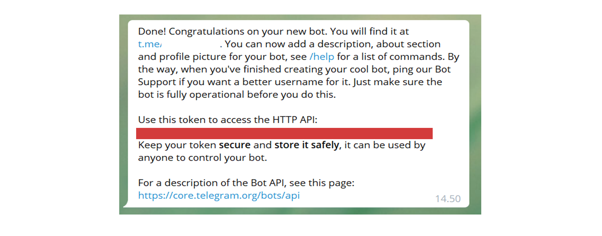

# Telegram bridge

## Create your Telegram bot

Go to Telegram and search and join the channel **@botfather**. You can see all the commands byt typing _/start_.

Next type _/newbot_ and press enter. Give your bot a name, it must end in `bot`. Your bot is now ready and you should get this feedback:



Copy your token to `TELEGRAM_BOT_TOKEN` .env. Put your token value inside quotation marks. Set `TG_BRIDGE_ENABLED=true`.

## Add your bot to your channel

Invite your bot to your Telegram channel. First go to your channel. From the right top corner choose three dots and from the drop down menu choose _Add members_. Give your bot name and press add.

Give your bot admin role (choose channel member and give your bot admin rights). You need to have an admin role to do this change. Under _What can this admin do?_ mark all the showing rights off.

## Get your Telegram channel id

For this you need to have your Discord bot running. On Telegram type _/id_. You should see on your console the channel id.

## Make the bridge

On your Discord server on the command channel use the command `!bridge`

```
!bridge text_channel_name id_from telegram

e.g. !bridge ohjelmistotekniikka -1201836398051

```

Your bridge is now ready.
