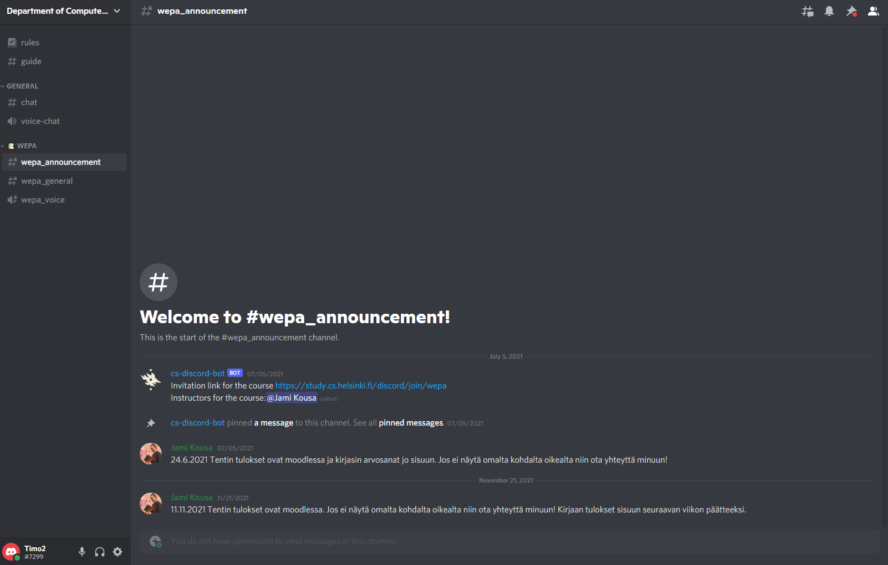

# User manual for student

### About Discord

To learn more about Discord in general, head over to their [official website](https://discord.com/). You can also check the [Beginner's Guide to Discord](https://support.discord.com/hc/en-us/articles/360045138571-Beginner-s-Guide-to-Discord#h_d33e3809-909b-4720-899d-db26c17bafa9).

The Department of Computer Science has a Discord server for course support. The server contains categories for courses where students can ask for help and offer peer support for other students. The server also has a bot that can help you with several things, including joining course channels, getting instructor info for a course, getting info on course workshops, and more.

We recommend that you use the Discord application (desktop app or mobile app). If you can't or don't want to download the application, you can use a browser-based version of Discord instead.

The participants of course channels are fellow students as well as volunteer instructors and faculty members. The channels' activities are voluntary. Please also help others reciprocally. However, do not share task answers to avoid accidentally depriving other students of learning opportunities. Little tips are instructive and still allow for the joy of learning yourself. Thank you.

### Create your Discord account
Create yourself a Discord account. You can do this on [Discord Website](https://discord.com/). If you already have an account, you can login [here](https://discord.com/login).

If you’re on a desktop or mobile device, you can directly open the Discord app on your device (You can learn more information on downloading the app [here](https://support.discord.com/hc/en-us/articles/360033931551)).

Once you’re at the login page, type in either _your email address_ or _phone number_ that has been officially verified to your Discord account. 

Note: You will need to verify your phone number to your Discord account before using phone number login! [Click here](https://support.discord.com/hc/en-us/articles/360033931551) to learn how to verify your phone number to your Discord account.

### Joining the Discord course channel

Go to your _Course page_ (MOOC, Moodle, etc.). From there you can find a link to the Discord channel of the course.

By clicking the link, you will be forwarded to the Discord server and automatically added to the course channel. The application should open to the _#guide_ text channel. Here you can see all the courses you can join as well as some basic instructions on how to use the Discord bot.

### How to use the bot

The Discord server has a bot that can help you with many things. Interaction with bot is achieved with Discord's slash commands.

Commands can be used by typing `/<command_name>` into the message area at the bottom of the application. You can see all the available commands as a list that opens after typing `/`. **Note that you have to manually type the commands; the bot rarely understands copy-pasted commands!**

The bot will suggest available commands based on what you've typed. For example, after typing `/i`, the bot will give a list of all available slash commands beginning with `i`. You can autofill the top-most command by pressing `TAB`.

You can see all the available commands and info about them with `/help`. You can also type `/help <command_name>` to get info on how to use a specific command, e.g. `/help instructors`.

You can see all the available courses with `/courses`.

By typing the command `/join`, you can see all the courses available on the list that opens. Pick up the course you want to join and press enter.

If you want to leave a course, use command `/leave`. You see from the list all the courses you have joined earlier. Choose a course you want to leave from and press enter.

After you have joined a course, you can see different course channels on the left bar. At this stage there are four types of channels; announcement, general, a voice channel, and possible added text channels  (these might change during the development).

- _Announcement_ - this is where teachers post announcements about the the course.
- _General_ - main discussion area.
- _Voice_ - voice channel where you can discuss with other students and instructors.
- _Other channels_ - There might also exist other channels on a course, for example Off-Topic channel or some very specific channels for a certain part of the course.

If you want to see the instructors on your course, you can use `/instructors` or head over to the _announcement_ channel.

If you want to know about workshop info for the course (e.g. when and where course instructors are available), you can use `/workshops`.

### List of commands

Command | Explanation | Arguments
--------|-------------|----------:
[/auth](./commands/general/auth.md) | For faculty members with student role to acquire the faculty role. | :x:
[/courses](./commands/general/courses.md) | Get public course information | :x:
[/help](./commands/general/help.md) | Get help how to use slash commands. | :o:
[/instructors](./commands/general/instructors.md) | Get course intructors information. | :x:
[/join](./commands/general/join.md) | Joins you into the course given, e.g., /join ohpe. | :heavy_check_mark:
[/leave](./commands/general/leave.md) | Remove you from the course given, e.g., /leave ohpe. | :heavy_check_mark:
[/workshops](./commands/general/workshops.md) | Get workshop info for the course. | :x:

### Material

[Source code for the Bot](https://github.com/Ohtuproju2021syksy/Discord-Bot-better)
